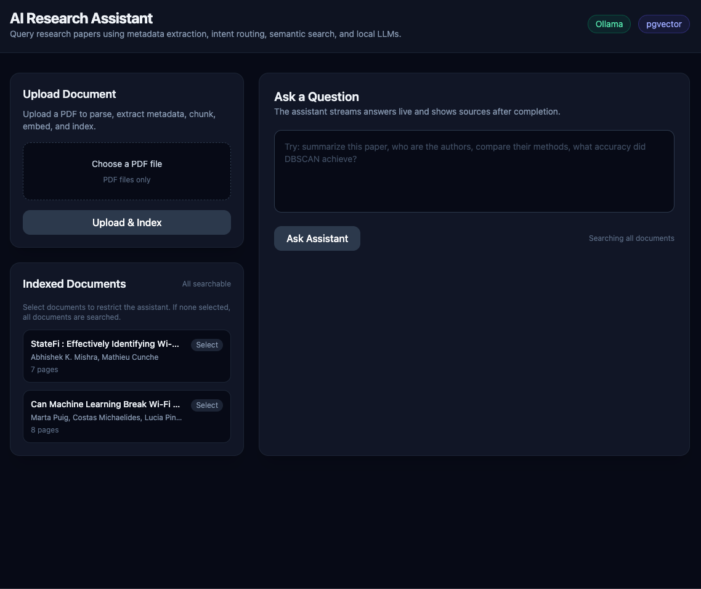
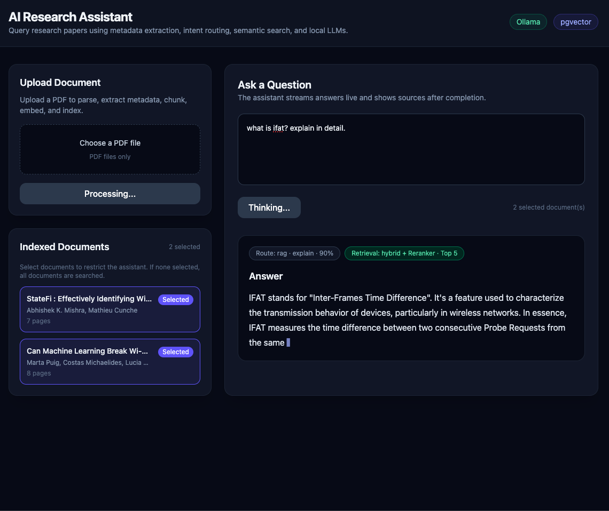
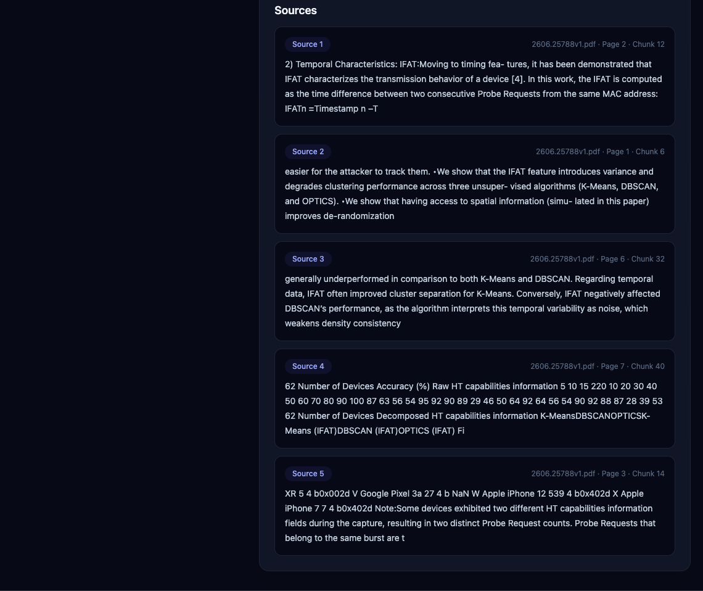
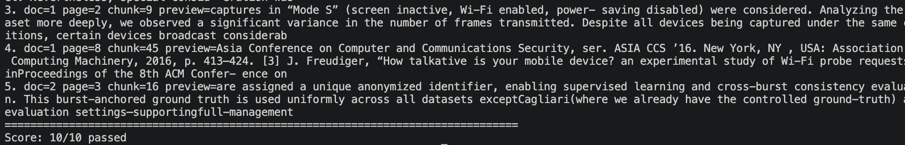

# AI Research Paper Assistant


A production-style AI Knowledge Platform for uploading research papers and querying them using metadata extraction, intent routing, hybrid retrieval, PostgreSQL/pgvector, FastAPI, React, Docling, Ollama, and Docker.

This project is intentionally more than a basic RAG chatbot. It separates document ingestion, metadata extraction, query routing, synthesis, comparison, retrieval, reranking, streaming, and evaluation into modular backend services.

---

## Highlights

* End-to-end AI document assistant built with React, FastAPI, PostgreSQL, pgvector, Ollama, and Docker
* PDF ingestion with Docling-based parsing
* LLM-based metadata extraction for title, authors, abstract, and page count
* Intent routing for metadata, synthesis, comparison, and RAG queries
* Hybrid retrieval using dense vector search and BM25-style keyword search
* Cross-Encoder reranking for better retrieval quality
* Page-aware citations
* Streaming responses using Server-Sent Events
* Evaluation pipeline for measuring retrieval quality
* Clean backend architecture using API, service, repository, schema, and model layers

---

## Screenshots

### Home



### Streaming Answer



### Source-Grounded Answer



### Evaluation Pipeline



---

## Features

### Document Processing

* Upload and index PDF research papers
* Parse PDFs using Docling
* Extract document metadata using a local LLM
* Store title, authors, abstract, and page count
* Create page-aware chunks for citations
* Generate local embeddings
* Store embeddings in PostgreSQL using pgvector

### Intelligent Query Routing

The assistant does not send every question through vector search.

It routes questions into:

* Metadata queries
* Summary / explanation queries
* Multi-document comparison queries
* Specific factual RAG queries

### Retrieval Pipeline

* Dense vector retrieval with pgvector
* BM25-style keyword retrieval using PostgreSQL full-text search
* Hybrid result merging
* Cross-Encoder reranking
* Source-grounded answer generation

### User Experience

* Select one or more documents before asking questions
* Stream answers live in the UI
* Show retrieved sources with filename, page number, and chunk reference
* Local-first development with Ollama

---

## Architecture

```text
React + TypeScript Frontend
        |
        v
FastAPI Backend
        |
        v
Query Router
        |
        |-- Metadata Service
        |-- Synthesis Service
        |-- Comparison Service
        |-- Hybrid Retrieval Service
        |
        v
Cross-Encoder Reranker
        |
        v
PostgreSQL + pgvector
        |
        v
Ollama Local LLM
```

---

## Ingestion Pipeline

```text
PDF Upload
   |
   v
Docling Parser
   |
   v
LLM Metadata Extraction
   |
   v
Page-Aware Text Extraction
   |
   v
LangChain Chunking
   |
   v
Embedding Generation
   |
   v
PostgreSQL + pgvector
```

---

## Query Flow

```text
User Question
   |
   v
Intent Router
   |
   |-- metadata   -> structured metadata lookup
   |-- synthesis  -> summary / explanation generation
   |-- comparison -> balanced retrieval across selected documents
   |-- rag        -> hybrid retrieval + reranking
   |
   v
Answer + Sources
```

---

## Tech Stack

### Frontend

* React
* TypeScript
* Vite
* Tailwind CSS
* Axios

### Backend

* FastAPI
* Python
* SQLAlchemy
* Alembic
* Pydantic

### AI / Retrieval

* Ollama
* Llama 3.2
* Sentence Transformers
* Cross-Encoder reranking
* LangChain text splitters
* Docling
* Hybrid search
* Server-Sent Events streaming

### Database

* PostgreSQL
* pgvector

### Infrastructure

* Docker
* Docker Compose
* GitHub Actions CI

---

## Project Structure

```text
ai-research-assistant/

backend/
  app/
    api/
      chat.py
      documents.py
      search.py

    core/
      config.py

    db/
      database.py

    models/
      document.py
      chunk.py

    repositories/
      document_repository.py
      chunk_repository.py

    schemas/
      chat_schema.py
      intent_schema.py
      metadata_schema.py

    services/
      chunking_service.py
      comparison_service.py
      document_parser_service.py
      document_service.py
      embedding_service.py
      hybrid_retrieval_service.py
      llm_service.py
      metadata_extraction_service.py
      metadata_query_service.py
      page_parser_service.py
      query_router_service.py
      reranking_service.py
      retrieval_service.py
      synthesis_service.py

  evals/
    questions.json
    run_eval.py

  alembic/
  Dockerfile
  requirements.txt

frontend/
  src/
    api/
    App.tsx

docker-compose.yml
README.md
```

---

## Local Setup

### Prerequisites

Install:

* Docker
* Docker Compose
* Ollama
* Node.js 20+

---

## 1. Clone the repository

```bash
git clone https://github.com/builtbysubu/ai-research-assistant.git
cd ai-research-assistant
```

---

## 2. Start Ollama

Install Ollama:

```text
https://ollama.com/download
```

Start Ollama:

```bash
ollama serve
```

Pull the model:

```bash
ollama pull llama3.2:3b
```

---

## 3. Start the application

```bash
docker compose up --build
```

Frontend:

```text
http://localhost:5173
```

Backend docs:

```text
http://localhost:8000/docs
```

---

## 4. Run database migrations

In a separate terminal:

```bash
docker compose exec backend alembic upgrade head
```

---

## Usage

1. Open the frontend
2. Upload one or more PDF research papers
3. Wait for indexing to complete
4. Select specific documents if needed
5. Ask questions

Example questions:

```text
Who are the authors?
```

```text
How many pages are there?
```

```text
What is the abstract?
```

```text
Summarize this paper.
```

```text
Explain this paper simply.
```

```text
Compare these two papers.
```

```text
What accuracy did DBSCAN achieve?
```

---

## API Endpoints

| Method | Endpoint            | Description                                                    |
| ------ | ------------------- | -------------------------------------------------------------- |
| `POST` | `/documents/upload` | Upload, parse, extract metadata, chunk, embed, and index a PDF |
| `GET`  | `/documents`        | List indexed documents                                         |
| `POST` | `/search`           | Run semantic search over chunks                                |
| `POST` | `/chat`             | Ask a non-streaming question                                   |
| `POST` | `/chat/stream`      | Stream an answer using Server-Sent Events                      |

---

## Evaluation

The project includes a lightweight retrieval evaluation pipeline.

Run:

```bash
docker compose exec backend python -m evals.run_eval
```

Example output:

```text
Question: What is IFAT?
Coverage: 100.00%
Result: PASS

Question: What accuracy did DBSCAN achieve?
Coverage: 100.00%
Result: PASS

Score: 10/10 passed
```

This evaluation checks whether retrieved chunks contain expected evidence for benchmark questions.

---

## Current Roadmap

* [x] React frontend
* [x] FastAPI backend
* [x] PostgreSQL + pgvector
* [x] Docker Compose
* [x] Ollama local LLM integration
* [x] Docling PDF parsing
* [x] LLM-based metadata extraction
* [x] Intent routing
* [x] Multi-document querying
* [x] Hybrid retrieval
* [x] Cross-Encoder reranking
* [x] Page-aware citations
* [x] Streaming responses
* [x] Evaluation pipeline v1
* [x] GitHub Actions CI

### Future Improvements

* [ ] Conversation history
* [ ] LLM-as-a-Judge evaluation
* [ ] User feedback collection
* [ ] Authentication
* [ ] Production deployment

---

## Engineering Notes

This project intentionally avoids treating every question as a vector search problem.

Instead:

* Metadata questions are answered from structured metadata
* Summary and explanation questions use synthesis
* Comparison questions retrieve balanced evidence across selected documents
* Specific factual questions use hybrid retrieval and reranking

This design is closer to a production AI knowledge system than a simple PDF chatbot.

---

## License

This project is licensed under the MIT License. See the `LICENSE` file for details.
